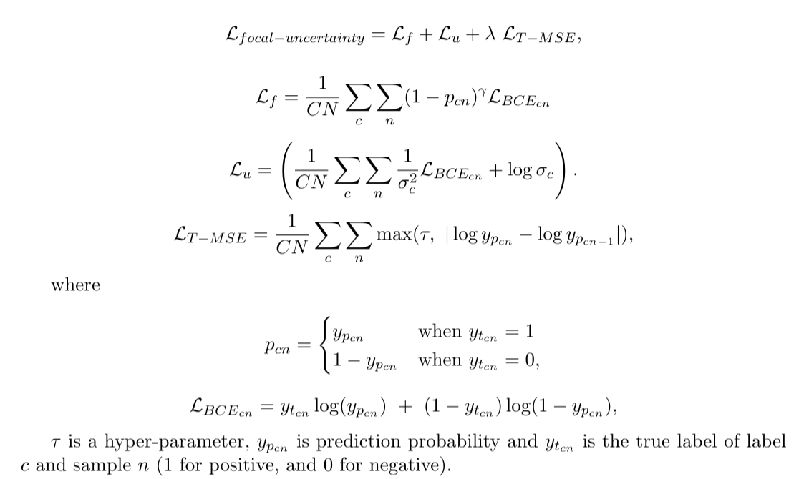

# Intraoperative Adverse Event Detection in Laparoscopic Surgery: Stabilized Multi-Stage Temporal Convolutional Network with Focal-Uncertainty Loss

4-stage Stab-TCN: the system that identifies bleeding and thermal injury event predictions in laparoscopic videos based on extracted features on stabilized frames.

You can find the paper [here](https://static1.squarespace.com/static/59d5ac1780bd5ef9c396eda6/t/60fb3a778591f203ee36a4cb/1627077241665/manuscript_optimized.pdf) published in _Machine Learning for Health Care 2021_. It will be available on PMLR volume 149 soon.

To cite, please use the following bibex:

```
@InProceedings{pmlr-v149-iae-video,
  title = {Intraoperative Adverse Event Detection in Laparoscopic Surgery: 
  Stabilized Multi-Stage Temporal Convolutional Network with Focal-Uncertainty Loss},
  author = {H. Wei, F. Rudzicz, D. Fleet, T. Grantcharov, and B. Taati},
  booktitle = {Proceedings of the 6th Machine Learning for Healthcare Conference},
  pages = {},
  year = {2021},
  volume = {149},
  series = {Proceedings of Machine Learning Research},
  month = {06--07 Aug},
  publisher = {PMLR}  
}
```


## Overview: 4-stage Stab-TCN

Our proposed intraoperative adverse event (iAE) detection system is a 4-stage stabilized temporal convolutional network (``4-stage Stab-TCN''). It consists of

1. A bundled camera path estimation algorithm to stabilize camera motion in laparoscopic views
2. I3D, a 3D CNN that extracts 1024 latent features on a sliding window of 50 frames
3. MS-TCN, a multi-stage temporal convolutional network that takes the [N x 1024] features, and produces N prediction for each video/procedure, where N is the number of sliding windows in each video

In this repository, we provide

- an optimized python implementation of stabilization algorithm that could achieve up to 10 FPS on 640 x 480 video on a 2.80GHz x 6 core and 32 GB memory machine, and
- an explanation of our implementation of the deep learning model (due to patent in progress we cannot disclose the actual code).

## Stabilization

bundled/ contains bundled camera-path stabilization algorithm: this algorithm divides the image into mesh, and computes homography for each mesh on two constraints:

- same bilinear interpolation of its four neighbours
- preserves similar shape (see paper for details)

At each mesh, computing local homography as an estimate of camera motion within the mesh. 
We constrain the local homography using a shape-preserving term to avoid strongly distorted warp on the full frame
because if two adjacent mesh with very different homograph will cause large distortion on the full image. 
The algorithm uses a factor α to control shape regularization. 

In the original implementation, α is a adaptive threshold determined at each optimization by minimizing the fitting error at 0.3 <= α < 3 with a pre-determined step size.
If the step size is too large, this opitmization becomes less effective, and if the step size is small then this process becomes inefficient.

We found that our task has many occlusions, and camera depth variation during a procedure. 
Using the adaptive approach is not very beneficial, therefore we use α = 3 to ensure smooth camera paths between cells. 

Instead of SURF features suggested by the original implementation, we use ORB features for model estimation. This increases the stabilization speed, while maintaining the quality.

### Installation (Linux)

Make sure you have the following installed on your system before running the installation

- wget
- tar
- bash
- g++
- conda with python3
- llvm 7.0.x, 7.1.x, or 8.0.x (because we are using llvmlite 0.31 for numba)

Install

```shell
conda create -n py37 python=3.7
conda activate py37
PYTHON_VERSION="37" ./install.sh
pip3 install bundled
```

Add opencv, and boost library path to your LD_LIBRARY_PATH

```shell
export LD_LIBRARY_PATH=$LD_LIBRARY_PATH:$OPENCV_LIBRARY_DIR:$BOOST_LIBRARY_DIR
```

Notes:

- If you have boost and Eigen installed, then use `--disable-download` and pass your Eigen and boost path in. See `./install.sh --help` for details. 
- This installation uses two custom packages:
    - numba: we forked the repository to fix the following problems because we won't be able to catch them in njt mode.
        - matrix inverse throw error on division by 0
        - singular matrix in matrix inverse throw error instead of returning None or -1
    - threadhandler: this package is written by [decewei](https://github.com/decewei), and imported to this package to manage multithreading, and multiprocessing.

#### Troubleshooting

- If you receive `fatal error: pyconfig.h: No such file or directory`,
please check if your python version is correct, and check if your `$CONDA_PREFIX/include/python{VERSION}` has `pyconfig.h`.

### Stabilization Usage

__1 Stabilize an mp4 and output an mp4__

`python stabilization.py stablize INPUT_PATH OUTPUT_DIR TARGET_HEIGHT TARGET_WIDTH`

Example

```shell
python stabilization.py stablize data/shaky.mp4 data/ 360 640
```

__2 Stabilize frames and return stabilize frame array__

Code example:

```python
from bundled import Bundled
mybundled = Bundled(frames,                                     # frames to stabilize
                    mesh_size=BUNDLED_MESH_SIZE,                # number of meshes to do local homography
                    padding=BUNDLED_PADDING,                    # number of padding around the frames for warping
                    maxIte=BUNDLED_MAX_ITE,                     # number of iterations during optimization
                    num_neigh_frames=BUNDLED_NUM_NEIGH_FRAMES,  # number of neighbouring frames to consider during optimization
                    rigidity=BUNDLED_RIGIDITY,                  # tolerance of distortion
                    output_path=None,                           # write mp4 to output_path if provided
                    frame_rate=BUNDLED_FPS,                     # output mp4 frame rate
                    batch_size=BUNDLED_BATCH_SIZE,              # run stabilization of mini-batch and in parallel
                    num_features=BUNDLED_NUM_FEATURES)          # number of features to extract in ORB
stabilized_frames = mybundled.stabilize()
```

Set `BUNDLED_DISABLE_PROGRESS_BAR` in bundled to enable/disable progress bar.

__3 Extract estimated camera paths (no optimization)__

Usage: `python stabilization.py extract INPUT_PATH TARGET_HEIGHT TARGET_WIDTH`

Feature will be saved in the same folder as the MP4FILE with `.features` extension.

### Relevant Stabilization Work

- The algorithm: [Bundled Camera-Paths for Video Stabilization](https://www.cs.sfu.ca/~pingtan/Papers/siggraph13.pdf)
- [Third-party MATLAB implementation by SunTanTank](https://github.com/SuTanTank/BundledCameraPathVideoStabilization/)
- [Bundled-Camera Path MeshWarp Core C++ implementation](http://www.liushuaicheng.org/SIGGRAPH2013/index.htm)

## I3D, MS-TCN, and Loss function 

You can find I3D at this [repository](https://github.com/deepmind/kinetics-i3d) and MS-TCN at this [repository](https://github.com/yabufarha/ms-tcn).

Our configuration is:

- an initial learning rate of 0.001, and 0.95 decay factor at each epoch
- sigmoid function as their final activation function as opposed to softmax function since the classes are not mutually exclusive
- resize frames from 1280 x 720 to 256 x 256, and apply data augmentation such as random flip and random contrast adjustment

I3D
- pre-trained on ImageNet and Kinetics with a mini-batch size of 8 sliding windows
- each sliding windows = 10 seconds @ 5 fps, with a stride of 1 frame

MS-TCN
- a batch size of 1 (1 full procedure)
- 4 layers of TCN with 10 layers of dilated residuals
- each layer has 64 filters with a filter width of 3
- use our focal and uncertainty loss terms because a training sample is a full procedure with event non uniformly distributed in the procedure,
  and sampling does not balance the dataset
  
Focal and uncertainty loss



## Citation

If you use this code, please cite this repository.

You can use the following bibtex to cite:

```
@inproceedings{decewei_stab_tcn_2021,
  title={Intraoperative Adverse Event Detection in Laparoscopic Surgery: Stabilized Multi-Stage Temporal Convolutional Network with Focal-Uncertainty Loss},
  author={H. Wei, F. Rudzicz, D. Fleet, T. Grantcharov, and B. Taati},
  journal={Machine Learning for Healthcare 2021},
  publisher={Machine Learning for Healthcare 2021},
  year={2021}
}
```
